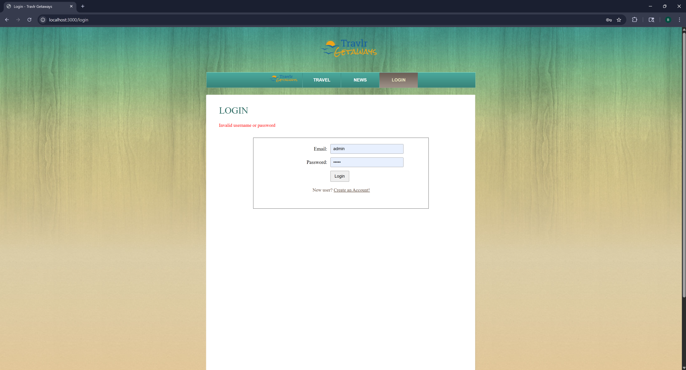
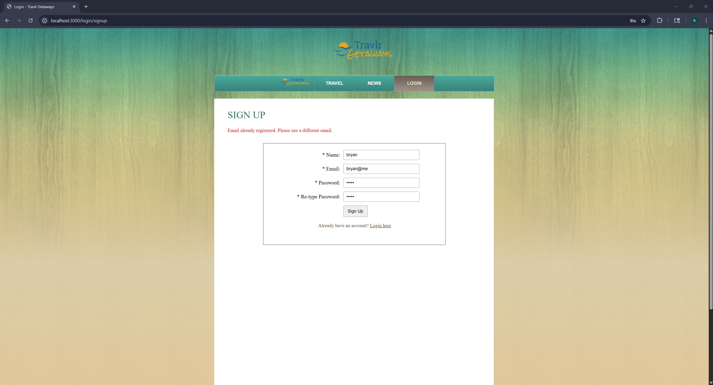

# franciscobortega.github.io

### Hi there! I'm Bryan 👋

I'm a SWE with a non-traditional path, reach out to me for any questions/advice! I am nearing the completion of my BS in Computer Science at Southern New Hampshire University! In my free time, I enjoy working out, learning new things, discovering new music, and exploring new places.

This Github Pages home page was created as part of the capstone project for CS 499. 

### Professional Self-Assessment

Traditional coursework throughout a computer science program often begins with very well-defined project requirements and expectations for simple ideas like a text-based game. The development of the ePortfolio here is a culmination of the learning and effort that has gone into mastering core concepts and experimenting with novel application. These are strengths that are indispensable to a successful professional career and help you stand out from the sea of applicants. In a field where everyone has worked on similar projects, it can be hard to stand out but that also gives passionate developers the opportunity to stand out as they speak brightly about something they have poured themselves into. 

For example, students within this and many other programs will likely have worked on a simple counter or to-do list app that emphasizes fundamentals but lacks real-world application or fails to demonstrate a developer’s depth in skillset. I personally picked up a passion project that blended my love for running and music into a cohesive project that has made it easy to bring up and discuss during interviews. The conversation has typically shifted in tone based on my excitement and tends to feel less like an interrogation. 

The aspect of transitioning from a student to professional also requires recognizing skills beyond just technical prowess. Collaboration within a team environment is integral to good development as it demonstrates your capacity to learn from others and teach where possible without “silo”-ing yourself. The role of a developer might be misconstrued as one where you can work heads down with no engagement from other people, but the reality is that role requires active communication with others, especially with people that might not have a strong technical background such as stakeholders. Being able to break down technical concepts for a broader audience rquires a firm understanding of the problem and solution at hand. 

Data structures and algorithms, software engineering and design, and databases are fundamental aspects of software development. They are cornerstones that shape how to formulate solutions from a set of requirements. Solutions should be methodical and account for potential edge cases. The more experienced a developer is in these domains, the easier it is for them to formulate various solutions while weighing the pros and cons of any given solution. Security is another aspect that blankets all facets of development. A developer must think widely about potential vulnerabilities for a proposed solution and account for security in new features. This practice ensures that we don’t move directly into an IDE but rather consider the impact of a decision beyond the code. 

These are all fundamental facets of a good developer and are skills that can readily be sharpened through consistent effort and exposure. 

The specific artifact seen in this portfolio is a singular project from a previous course, namely a full-stack application that was partially built out but lacked many of the end-to-end features that would provide a cohesive experience. Each of the proposed enhancements 
The basis for selecting this artifact was the wide range it provided in technology as the application was built on the MEAN (MongoDB, Express, Angular, and Node) stack and because there was significant room for improvement across the app from its initial build out. Each of the aforementioned domains was considered profusely to determine what an appropriate development effort would look like while ensuring that deadlines could be met without sacrificing quality of code or functionality. 

My professional interest lies in full-stack engineering, and this artifact provided a general sense of what that work would look like as you synonymously have to be well-versed in frontend and backend technologies. Recognizing architecture patterns and ensuring that the code that is written aligns with these standards requires a diligent understanding of each component in the application and its intended purpose in data management and manipulation. The end result has become a fully functioning app with real-world standards for development and security that do not rely on sloppy implementation or bad practices. 

### Code Review

The following is a half hour review of the code before an enhancement implementation occurred. The review purely sought to explore the existing state of the code while identifying any areas of concern that would be addressed. A breakdown of each of the proposed enhancements was also provided within the context of the relevant code or any new code that would have to be added to satisfy the set expectations and course outcomes.

You can watch the code review here: https://youtu.be/WUrsvjuygpY

### Software design and engineering - Enhancement One

> PR: https://github.com/franciscobortega/CS465-fullstack/pull/9

This enhancement was primarly focused on the proper implementation of Authentication/Authorization to fully complete the Login/Signup functionality of the app. The reservation functionality was also implemented in an MVP state. 

Role-based access control (RBAC) was added with a `role` property for newly created accounts. The system defaults to `user` role and will display the following when a user logs in, specifically note the navigation bar:

When an Admin logs in, they will see the following in the navigation instead which helps limits access to the administrative SPA:

Error handling was added to gracefully handle instances where the username/password combination does not match:

And also when a new user tries to create an account with an email that is already used:

### Algorithms and data structure - Enhancement Two

> PR: https://github.com/franciscobortega/CS465-fullstack/pull/10

This enhancement primarily focused on the addition of a search feature for the Admin SPA (single page application) with the implementation of two search algorithms (bubble sort and merge sort).

### Databases - Enhancement Three

> PR: https://github.com/franciscobortega/CS465-fullstack/pull/11

This enhancement was primarily focused on the addition of a new model to mimic a cart-based shopping experience that would include persisted database management for logged in users. 

