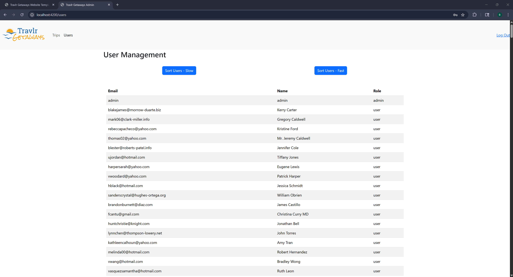
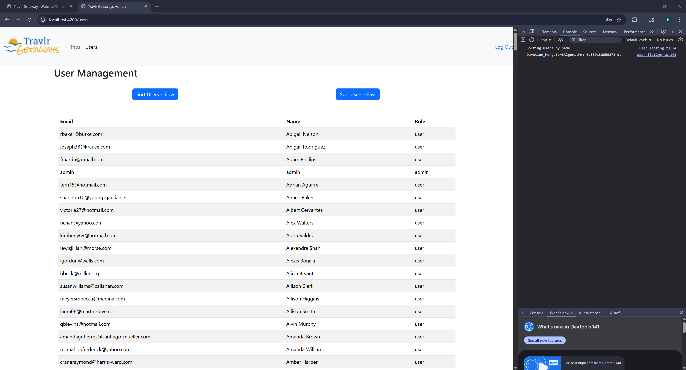
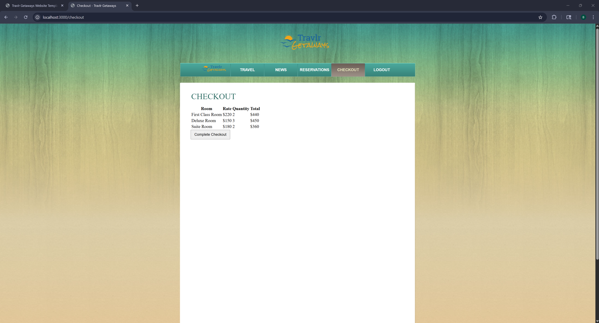
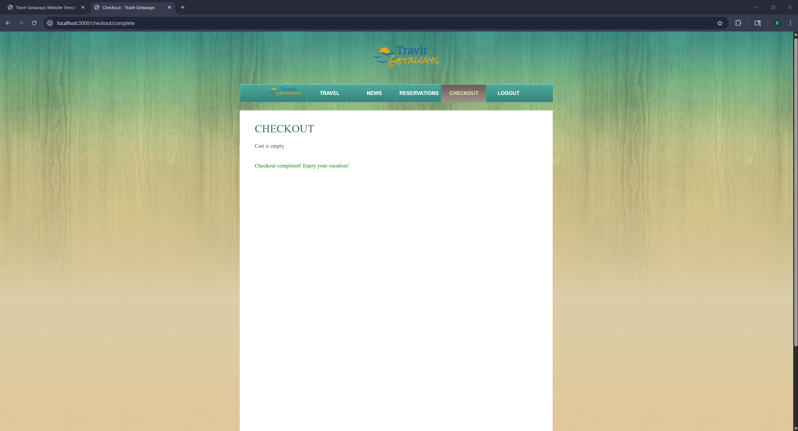

# franciscobortega.github.io

### Hi there! I'm Bryan 👋

I'm a SWE with a non-traditional path, reach out to me for any questions/advice! I am nearing the completion of my BS in Computer Science at Southern New Hampshire University! In my free time, I enjoy working out, learning new things, discovering new music, and exploring new places.

This Github Pages home page was created as part of the capstone project for CS 499. 

### Professional Self-Assessment

Traditional coursework throughout a computer science program often begins with very well-defined project requirements and expectations for simple ideas like a text-based game. The development of the ePortfolio here is a culmination of the learning and effort that has gone into mastering core concepts and experimenting with novel application. These are strengths that are indispensable to a successful professional career and help you stand out from the sea of applicants. In a field where everyone has worked on similar projects, it can be hard to stand out but that also gives passionate developers the opportunity to stand out as they speak brightly about something they have poured themselves into. 

For example, students within this and many other programs will likely have worked on a simple counter or to-do list app that emphasizes fundamentals but lacks real-world application or fails to demonstrate a developer’s depth in skillset. I personally picked up a passion project that blended my love for running and music into a cohesive project that has made it easy to bring up and discuss during interviews. The conversation has typically shifted in tone based on my excitement and tends to feel less like an interrogation. 

The aspect of transitioning from a student to professional also requires recognizing skills beyond just technical prowess. Collaboration within a team environment is integral to good development as it demonstrates your capacity to learn from others and teach where possible without “silo”-ing yourself. The role of a developer might be misconstrued as one where you can work heads down with no engagement from other people, but the reality is that role requires active communication with others, especially with people that might not have a strong technical background such as stakeholders. Being able to break down technical concepts for a broader audience rquires a firm understanding of the problem and solution at hand. 

Data structures and algorithms, software engineering and design, and databases are fundamental aspects of software development. They are cornerstones that shape how to formulate solutions from a set of requirements. Solutions should be methodical and account for potential edge cases. The more experienced a developer is in these domains, the easier it is for them to formulate various solutions while weighing the pros and cons of any given solution. Security is another aspect that blankets all facets of development. A developer must think widely about potential vulnerabilities for a proposed solution and account for security in new features. This practice ensures that we don’t move directly into an IDE but rather consider the impact of a decision beyond the code. 

These are all fundamental facets of a good developer and are skills that can readily be sharpened through consistent effort and exposure. 

The specific artifact seen in this portfolio is a singular project from a previous course, namely a full-stack application that was partially built out but lacked many of the end-to-end features that would provide a cohesive experience. Each of the proposed enhancements 
The basis for selecting this artifact was the wide range it provided in technology as the application was built on the MEAN (MongoDB, Express, Angular, and Node) stack and because there was significant room for improvement across the app from its initial build out. Each of the aforementioned domains was considered profusely to determine what an appropriate development effort would look like while ensuring that deadlines could be met without sacrificing quality of code or functionality. 

My professional interest lies in full-stack engineering, and this artifact provided a general sense of what that work would look like as you synonymously have to be well-versed in frontend and backend technologies. Recognizing architecture patterns and ensuring that the code that is written aligns with these standards requires a diligent understanding of each component in the application and its intended purpose in data management and manipulation. The end result has become a fully functioning app with real-world standards for development and security that do not rely on sloppy implementation or bad practices. 

### Code Review

The following is a half hour review of the code before an enhancement implementation occurred. The review purely sought to explore the existing state of the code while identifying any areas of concern that would be addressed. A breakdown of each of the proposed enhancements was also provided within the context of the relevant code or any new code that would have to be added to satisfy the set expectations and course outcomes.

You can watch the code review here: https://youtu.be/WUrsvjuygpY

The initial artifact can be found here: https://github.com/franciscobortega/CS465-fullstack/tree/module7-2

The state of the code at this point was passable but did not demonstrate any real-world expectations for quality and security. Most of this implementation was meant to serve an MVP-style model while leaving room for enhancments as the developer saw fit. The following enhancements aimed to make the application feel whole from account creation to reservation checkout while accounting for common edge cases that could crash the application. 

### Software design and engineering - Enhancement One

> PR: https://github.com/franciscobortega/CS465-fullstack/pull/9

This enhancement was primarly focused on the proper implementation of Authentication/Authorization to fully complete the Login/Signup functionality of the app. The reservation functionality was also implemented in an MVP state. 

Role-based access control (RBAC) was added with a `role` property for newly created accounts. The system defaults to `user` role and will display the following when a user logs in, specifically note the navigation bar:

When an Admin logs in, they will see the following in the navigation instead which helps limits access to the administrative SPA:

Error handling was added to gracefully handle instances where the username/password combination does not match:

And also when a new user tries to create an account with an email that is already used:

  
Full Length Narrative for Enhancement One

  1.	Briefly describe the artifact. What is it? When was it created?

The artifact that has been selected for Enhancement One is a full stack application that was created in CS 465 Full Stack Development I. The application was a travel reservation-based system where users could register and sign in to browse and select vacation packages. The application also featured a single page application for admin access that allowed administrative staff to manage travel packages. This project was built on the MEAN stack which includes MongoDB, Express.js, Angular, and Node.js. 

2.	Justify the inclusion of the artifact in your ePortfolio. Why did you select this item? What specific components of the artifact showcase your skills and abilities in software development? How was the artifact improved?

I opted to work on this full stack application because it gave me an opportunity to identify and implement features that I had previously considered interesting to learn and engage with. As a backend developer seeking a full stack role, it also gave me an idea of what that spectrum looks like. The specific components of the artifact that highlight my skills would be the implementation of authentication/authorization for registered users that directly check the database while leveraging JWT tokens and session management. 

The app itself is composed of an app_admin, app_server, and app_api component that all connect. As a developer, I had to be aware of how the form data for a login submission, for example, is sent from the client side to the server side and the exact organization of functions to make the project maintable and adaptable. Sign up and login were originally hardcoded for testing purposes, and the aim of this enhancement was to implement both features such that a user could create their account with a hashed password and log in securely. There were edge cases like existing email that I made sure to gracefully handle and implemented role-based access control to determine what a default user versus admin would have access to. 

The functionality of the application is now well-defined and implemented end-to-end without dependencies on hardcoded or insecure methods. 

3.	Did you meet the course outcomes you planned to meet with this enhancement in Module One? Do you have any updates to your outcome-coverage plans?

I was able to meet two of the three outcomes I had proposed to meet with this enhancement. The fact of the matter was that although this enhancement covered a lot of components of the full stack application, it didn’t really require the use of specific algorithmic principles (Course Outcome 3) as will be covered by Enhancement Two next week. This is not a concern as that course outcome is still appropriately accounted for.
Enhancement One was a good opportunity to explore the application of techniques and tools that one might leverage in a professional role. (Course Outcome 4) For example, I leveraged Postman to confirm that my API endpoints worked as expected with the MongoDB database before wiring everything up with my front-end code. New features were tested and revised to ensure that the app didn’t crash in unexpected ways. This security mindset (Course Outcome 5) prevents bad code from being pushed for the sake of a solution even for a project like this one that would not see production deployment for users.

4.	Reflect on the process of enhancing and modifying the artifact. What did you learn as you were creating it and improving it? What challenges did you face?

This enhancement was fun and engaging from whiteboarding some ideas to seeing them slowly come together. What I learned most was the importance of testing your functionality for various edge cases. When I had implemented a proper user registration endpoint, I decided to see what would happen if I tried creating another user with the same email address. MongoDB threw an error that crashed the whole app. My initial solution tried handling the error on the server, but this still crashed the app as the response was still bubbling up from the Mongoose ODM. Moving the try-catch logic to the actual code that engaged with MongoDB made it easy to then gracefully handle this specific error. If I had not tested my new code for this and other cases it might not have been resolved until later which could become an issue when working with live applications. Steeping away from the solution and code to think about the problem is a necessary mindset to embrace. 

A key challenge I faced was the organization of code into modular, logical components. I found myself implementing API code in a component that was specifically meant to handle rendering of the client view. While this was feasible, it would have led to spaghetti code that would make collaborating with other developers a nightmare. This is why it is important to document the flow of data so that the same pattern can be followed by others. Other minor challenges were learning how to work with Axios and asynchronous functions, but this was more of a learning curve than a challenge. A full stack project offers plenty of opportunities to touch new technologies and tools. That was a fundamental reason for deciding to pursue all the enhancements through this single artifact. 

### Algorithms and data structure - Enhancement Two

> PR: https://github.com/franciscobortega/CS465-fullstack/pull/10

This enhancement primarily focused on the addition of a search feature for the Admin SPA (single page application) with the implementation of two search algorithms (bubble sort and merge sort).

The initial implementation required seeding the database with 500 randomly generated users to ensure that the application of both algorithms could be compared:

Bubble Sort was selected as a simplistic sort to be implemented to demonstrate basic knowledge of data structures and algorithms:

Merge Sort was selected as a more complex yet more advantageous algorithm for sorting. Note the time in the console compared to the time for bubble sort:

  
Full Length Narrative for Enhancement Two

1.	Briefly describe the artifact. What is it? When was it created?

The artifact that has been selected for Enhancement Two is a full stack application that was created in CS 465 Full Stack Development I and the same artifact that was selected for Enhancement One. The application was a travel reservation-based system where users could register and sign in to browse and select vacation packages. The application also featured a single page application for admin access that allowed administrative staff to manage travel packages. This project was built on the MEAN stack which includes MongoDB, Express.js, Angular, and Node.js. 

2.	Justify the inclusion of the artifact in your ePortfolio. Why did you select this item? What specific components of the artifact showcase your skills and abilities in software development? How was the artifact improved?

I opted to work on this full stack application because it gave me an opportunity to identify and implement features that I had previously considered interesting to learn and engage with. As a backend developer seeking a full stack role, it also gave me an idea of what that spectrum looks like. The specific components of the artifact that highlight my skills would be the implementation of two different algorithms to enhance a search feature of the applicaiton. 

The search feature gave me some additional exposure to MongoDB as I had to provision a collection of users to later apply the search algorithms to. This was accomplished through the use of an existing seeding script that only required setting up some routes and mock data for 500 users. The next focus was to select two algorithms to research and implement. I decided to do bubble sort for a simpler implementation that still accomplished the same goal and merge sort for a bit more of a challenge. These two algorithms also provided an opportunity to visually see why algorithmic design matters. Even with a small sample size, the efficiency of merge sort versus bubble sort was significantly evident. 

The functionality of the application is now well-defined and improved for administrative users. Previously, the Admin Single Page Application was limited in functionality to only interact with Trip data but now admins can see and modify users in a secure manner. This opens the ability for password resets that could be explored from the user perspective as well. 

3.	Did you meet the course outcomes you planned to meet with this enhancement in Module One? Do you have any updates to your outcome-coverage plans?

I was able to meet all of the outcomes I had proposed to meet with this enhancement and an additional one that had already been covered by Enhancement One. This one truly required the use of specific algorithmic principles (Course Outcome 3) so most of the other course outcomes were centered around documentation.

I explored a bit of security (Course Outcome 5) with Enhancement Two as I had to account for how the user data that was being pulled from the database would be presented. For example, we have the hash and salt for a user saved in the database and the response payload would have included this information from the generic database query without specifying what fields we really want. During and after implementation of the two algorithms, I made sure to validate the efficiency for each. This was a very basic logging of the time to sort to the console, but these results were commented to track how significant the difference was for a small-scale application. This documentation of the work and results (Course Outcome 2) ensures that the decision to integrate one over the other can be understood by another developer with practical results. 

4.	Reflect on the process of enhancing and modifying the artifact. What did you learn as you were creating it and improving it? What challenges did you face?

Enhancement Two was a book of work that taught a lot. The original plan was to implement the search feature and then manually improve the algorithm, but I found myself lacking inspiration around this idea. I shifted to implementing some well-documented algorithms instead so that I could sit with the code and understand why efficiency matters. This was also a good opportunity to re-learn some data structures and patterns in design. 

This artifact required walking back through the code to learn basic architecture for a MEAN application. Setting up routes and validating that my logic was correct was probably the most significant challenge as I don’t work too closely with this tech stack, but it was fun. I learned through improvement how much an algorithm matters and how few developers could readily implement a standard algorithm like bubble sort from scratch. High-level languages often provide sorting algorithms that are already optimal. There are performance applications that matter down to the millisecond but for most people this would be negligible. The end of the enhancement opened opportunities for further enhancements.

### Databases - Enhancement Three

> PR: https://github.com/franciscobortega/CS465-fullstack/pull/11

This enhancement was primarily focused on the addition of a new model to mimic a cart-based shopping experience that would include persisted database management for logged in users. 

The reservations page was enhanced to move away from a session-based cart. Information about a given `room` reservation is saved to the database for a given logged in user:

A user can log out and log back in and still see their persisted cart items at the checkout page:

Once a user completes their checkout, their cart is cleared in the backend but the user can liberally continue to engage with the reservation system:

  
Full Length Narrative for Enhancement Three

1.	Briefly describe the artifact. What is it? When was it created?

The artifact that has been selected for Enhancement Three is the same full stack application that was created in CS 465 Full Stack Development I and the same artifact that was selected for the last two enhancements. The application is a travel reservation-based system where users can register and sign in to browse and select vacation packages. The application also features a single page application for admin access that allows administrative staff to manage travel packages. This project was built on the MEAN stack which includes MongoDB, Express.js, Angular, and Node.js. 

2.	Justify the inclusion of the artifact in your ePortfolio. Why did you select this item? What specific components of the artifact showcase your skills and abilities in software development? How was the artifact improved?

I opted to work on this full stack application because it gave me an opportunity to identify and implement features that I had previously considered interesting to learn and engage with. As a backend developer seeking a full stack role, it also gave me an idea of what that role and its associated work and workflow might look like. 

The specific components of the artifact that showcase my skills and abilities in the Database category would the refinement of the enhancement itself to identify a viable feature to implement and how those individual components come together to create a uniform system. As the application became more complex, the significance of clear documentation, naming conventions, and standardization of code became more evident. Some interactions like persisting a user’s cart required interaction with all 3 database models to ensure a streamlined experience for the user.

The was the primary improvement made to the artifact. A new model to represent the types of reservations was made while leveraging the reservation model itself as a “cart” that a logged in user could save and have access to even after logging out from the session. There was a lot of overlap with existing components that made tracking and validating changes more prominent.  

3.	Did you meet the course outcomes you planned to meet with this enhancement in Module One? Do you have any updates to your outcome-coverage plans?

I was able to meet all the outcomes I had proposed to meet with this enhancement and covered various others that had already been met prior. The growing complexity of the application required clear technical communication through code (Course Outcome 1) to ensure that each directory and file was accounted for and understood. It can be hard to follow the data flow of a form submission through to the backend and back to the user but clear commentary makes this feasible. 

This project required coming up with elegant solutions to make the user experience enjoyable without compromising the quality of the code (Course Outcome 4) and truly understanding the tools and techniques used to make something happen. Code is versatile and just because an implementation works in one location doesn’t mean it makes semantic sense. Security is always a consideration (Course Outcome 5) and edge cases that could crash the app were tested to ensure that we only saw what a given user needed to see without exposing any vulnerabilities that might not have been accounted for. 

4.	Reflect on the process of enhancing and modifying the artifact. What did you learn as you were creating it and improving it? What challenges did you face?

Enhancement Three made me realize how significant proper planning is. I spent a large amount of time determining that my initial plan had mostly already been implemented by previous dependencies from earlier enhancements and had to pivot. The final decision was to complete the application end to end by finishing out the reservation and checkout workflow. This would touch on the Database category as new models, seeds, and CRUD operations had to be set up. This iteration required learning a bit more about MongoDB and how a model can be leveraged with other models to create a cohesive experience like that of a logged in user getting their previously saved reservations back without any unintended results like other user data. 

The main challenge for this enhancement was managing the flow of data between components and ensuring that we were properly querying the database for the intended data. There was no significant blockers for the majority of the code apart from the usual suspect of relearning routing. Altogether, the decision to pivot allowed for the completion of the complete application without any odd and distinctly noticeable bugs. Further enhancements could be made to the UI but for now the MVP core functionality has been met and exceeded.

### Summary

The artifact intially lacked much of the final functionality seen here. The application lacked proper authentication and initially depended on hard-coded values to give the illusion of a proper login/signup process. There was also no end-to-end functionality for what a user or admin could do within their respective domains. The culmination of all these enhancements resulted in a project where a user could create an account, engage with reservation and checkout mechanisms, and persist their data outside of the current session. Administrative staff could handle users and trip data that is ultimately displayed to the users on the frontend. Altogether the artifact was transformed from a nebulous blob of ideations to a cohesive application that reflects modern practices in standardization and security. 

Breaking changes were identified and resolved within this MVP (minimum viable product) build. Future steps with this project could be to explore proper testing, e.g. unit, component, and integration testing, UI/UX improvements, or even deployment to understand that process itself. The final product here from the enhancements aligns with the set expectations while being cohesive.

